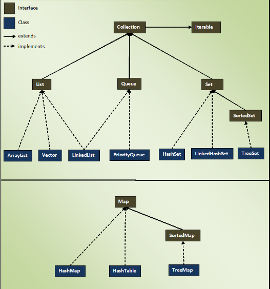
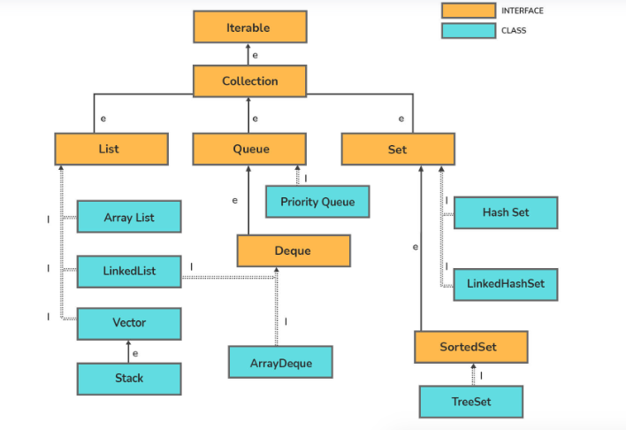
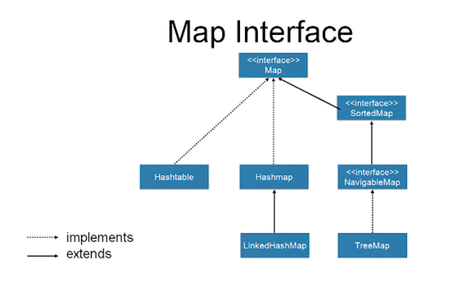
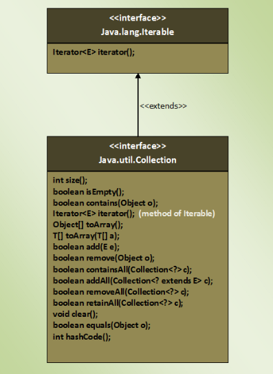

# Introduction
### Collection Framework
- Collections are introduced in java 2/ JDK 1.2. 
- Arrays were used earlier, but they are not re-sizable.
- Prior to Java 2 we have classes like Dictionary, Vector, Stack and Properties. But each of them handle object differently.
- So collection framework was introduced to overcome the drawbacks of array and handle group of objects in a unified way. 
- we can store objects as list, set, queue, map and perform CRUD operations like adding, removing or sorting objects.

### Collection Interface 
- Collection is a root level interface of the Java Collection Framework.
- Most of the classes in Java Collection Framework inherit from this interface. 
    - List, Set and Queue are main sub interfaces of this interface. 
- JDK doesn’t provide any direct implementations of this interface.
     - But, JDK provides direct implementations of it’s sub interfaces. 
     - ArrayList, Vector, HashSet, LinkedHashSet, PriorityQueue are some indirect implementations of Collection interface. 
- Collection interface is a member of java.util package.

### Collection Interface vs Collections Class

|Collection Interface | Collections Class|
|---|---|
|Collection is a root level interface of the Java Collection Framework.|Collections is an utility class in java.util package.|
|JDK doesn’t provide any direct implementations of this interface.But, JDK provides direct implementations of it’s sub interfaces. |It consists of only static methods which are used to operate on objects of type Collection.|

### Collection Hierarchy 

- present in java.util package.

### Iterable Interface
- presents in java.lang package.
- has one method called iterator()
- Iterator<E> iterator();
- using the Iterator object we can iterate over the elements of Collection.

### List Interface
- ordered or sequential collection of objects.
- ordered using zero based index.
- may contain duplicate or multiple null elements.
- insertion, retrival, updation and deletion can be done at any position.

| ListIterator | Iterator |
|--|--|
| Can traverse in forward and backward direction | Can be used to traverse only in forward direction |
| Can be used only for List| Can be used for List, Set and Queue|
| we can perform modifications(insert, replace, remove)| we can only remove elements from the collection|
| we can iterate a list from a specified index | is not possible with iterator | 
|<li>boolean hasNext() </li><li>boolean hasPrevious()</li><li>E next()  </li><li>E previous() </li><li>int nextIndex() </li><li>int previousIndex() </li><li>void remove()</li><li>void set(E e)</li><li>void add(E e) | <li> boolean hasNext() </li><li> E next() </li><li>void remove() </li>|

### Methods Of java.Util.Collections
> Lower Bounded Wildcards: List<? super Integer> represents E or super types of E

- static <T> void copy(List<? super T> dest, List<? extends T> src)
    - method is used to copy all elements from one list to another list.
---
- static int frequency(Collection<?> c, Object o)
    - method checks the number of occurrences of a specified element in the given Collection.
---
- static <T extends Object & Comparable<? super T>> T max(Collection<? extends T> coll) 
    - it returns the maximum element in the given Collection.
---
- static <T extends Object & Comparable<? super T>> T min(Collection<? extends T> coll)
    - it returns the minimum element in the given Collection.
---
- static <T> boolean replaceAll(List<T> list, T oldVal, T newVal) 
    - it replaces all occurrences of old value with new value in the given list.
---
- static <T extends Comparable<? super T>> void sort(List<T> list) 
    - method sorts the specified list in the ascending order.
    - this method sorts the specified list according to natural ordering of its elements.
---
- static <T> void sort(List<T> list, Comparator<? super T> c)
    - method sorts the specified list according to supplied Comparator.
---
- static <T> Collection<T> synchronizedCollection(Collection<T> c) 
    - method returns the synchronized version of the specified Collection.
---
- static <T> List<T> synchronizedList(List<T> list)
    - method returns the synchronized i.e thread safe list backed by the specified list.
---
- static <K,V> Map<K,V> synchronizedMap(Map<K,V> m)
    - method returns the synchronized map backed by the specified map.
---
- static <T> Set<T> synchronizedSet(Set<T> s) 
    - method returns the synchronized Set backed by the specified Set.
---
- static <T> Comparator<T> reverseOrder()
    - can sort the list in the reverse order also by passing the Comparator returned by Collections.reverseOrder() as Comparator to Collections.sort() method.
    - `Collections.sort(list, Collections.reverseOrder());`
---
- static void reverse(List<?> list)
    - method reverses the order of elements in the specified collection.
---
- static boolean disjoint(Collection<?> c1, Collection<?> c2) 
    - method returns true if two specified collections have no elements in common.
---
-  static <T>
    int binarySearch(List<? extends Comparable<? super T>> list, T key)
    - method searches the specified collection for the specified object using binary search algorithm.
---
- static void shuffle(List<?> list)
    - method randomly shuffles the elements in the specified collection.
---

