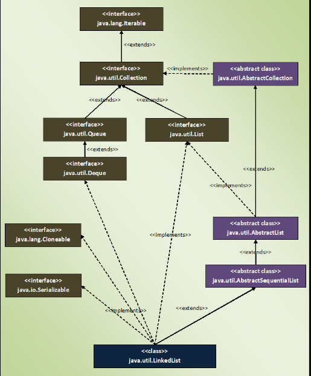

### Linked List
```java
public class LinkedList<E>
    extends AbstractSequentialList<E>
    implements List<E>, Deque<E>, Cloneable, java.io.Serializable
```
- node contains:
    - reference to previous element
    - actual value of element
    - reference to next element
- LinkedList class in Java is an implementation of doubly linked list which can be used both as a List as well as Queue
- can have null and duplicates
- elements can be inserted and removed from both ends and can be retrieved from any arbitrary position

### Hierarchy of LinkedList


### Properties
- Insertion and removal operations in LinkedList are faster than the ArrayList.
    - because in LinkedList, there is no need to shift the elements after each insertion and removal.
    - only references of next and previous elements need to be changed.
- Retrieval of the elements is very slow in LinkedList as compared to ArrayList.
    - Becaues in LinkedList, you have to traverse from beginning or end to reach the element.
- The LinkedList can be used as stack. It has the methods pop() and push() which make it to function as Stack.
- The LinkedList can also be used as ArrayList, Queue, SIngle linked list and doubly linked list.
- LinkedList class in Java is not of type Random Access. i.e the elements can not be accessed randomly. 

### Methods
- offer() and poll() methods which make LinkedList to work as a Queue.
- Insertion At Head
    - void addFirst(E e)
        - Inserts the specified element at the beginning of this list.
    - boolean offerFirst(E e)
        - Inserts the specified element at the front of the list.
- Insertion In The Middle
    - void add(int index, E element)
        - Inserts the specified element at the specified position in the list.
    - boolean addAll(int index, Collection<? extends E> c) 
        - Inserts all of the elements in the specified collection into the list, starting at the specified position.
- Insertion At Tail
    - boolean add(E e)
        - Appends the specified element to the end of the list.
    - boolean addAll(Collection<? extends E> c)
        - Appends all of the elements in the specified collection to the end of the list, in the order that they are returned by the specified collection's iterator
    - boolean offer(E e)
        - Adds the specified element as the tail (last element) of the list.
    - boolean offerLast(E e)
        - Inserts the specified element at the end of the list.
- Removing from head
    - E poll()
        - Retrieves and removes the head (first element) of the list. 
    - E pollFirst() 
        - Retrieves and removes the first element of the list, or returns null if the list is empty.
    - E remove() and E removeFirst()
        - Retrieves and removes the head (first element) of this list.
- Removing from the middle
    - E remove(int index)
        - Removes the element at the specified position in this list. Returns the element that was removed from the list.
- Removing from the tail
    - E pollLast() 
        - Retrieves and removes the last element of the list or returns null, if the list is empty.
    - E removeLast()
        - Removes and returns the last element from the list.
- Retrieving from the head
    - E element() 
        - Retrieves, but does not remove, the head (first element) of the list.
    - E getFirst()
        - Returns the first element in the list.
    - E peek()
        - Retrieves, but does not remove, the head (first element) of the list.
    - E peekFirst()
        - Retrieves, but does not remove, the first element of the list, or returns null, if the list is empty.
- Retrieving from the middle
    - E get(int index)
        - Returns the element at the specified position in this list.
- Retrieving from the tail
    - E getLast()
        - Returns the last element in the list.
    - E peekLast()
        - Retrieves, but does not remove, the last element of the list, or returns null, if the list is empty.

---
- Iterator<E> descendingIterator() 
    - method which returns an Iterator object containing all elements of a LinkedList in the reverse order i.e from tail to head.
```java
 Iterator<String> it = list.descendingIterator();
```
- boolean removeFirstOccurrence(Object o)
    - removeFirstOccurrence(Object 0) to remove the first occurrence of a given element 

- boolean removeLastOccurrence(Object o) 
    - use removeLastOccurrence(Object 0) to remove last occurrence of a given element 


## Differences Between ArrayList And LinkedList In Java:

|                                            | ArrayList                                                                                                                                    | LinkedList                                                                                                                                                                                                                                    |
|--------------------------------------------|----------------------------------------------------------------------------------------------------------------------------------------------|-----------------------------------------------------------------------------------------------------------------------------------------------------------------------------------------------------------------------------------------------|
| Structure                                  | ArrayList is an index based data structure where each element is associated with an index.                                                   | Elements in the LinkedList are called as nodes, where each node consists of three things – Reference to previous element, Actual value of the element and Reference to next element.                                                          |
| Insertion And Removal                      | Insertions and Removals in the middle of the ArrayList are very slow. Because after each insertion and removal, elements need to be shifted. | Insertions and Removals from any position in the LinkedList are faster than the ArrayList. Because there is no need to shift the elements after every insertion and removal. Only references of previous and next elements are to be changed. |
|                                            | Insertion and removal operations in ArrayList are of order O(n).                                                                             | Insertion and removal in LinkedList are of order O(1).                                                                                                                                                                                        |
| Retrieval(Searching or getting an element) | Retrieval of elements in the ArrayList is faster than the LinkedList . Because all elements in ArrayList are index based.                    | Retrieval of elements in LinkedList is very slow compared to ArrayList. Because to retrieve an element, you have to traverse from beginning or end (Whichever is closer to that element) to reach that element.                               |
|                                            | Retrieval operation in ArrayList is of order of O(1).                                                                                        | Retrieval operation in LinkedList is of order of O(n).                                                                                                                                                                                        |
| Random Access                              | ArrayList is of type Random Access. i.e elements can be accessed randomly.                                                                   | LinkedList is not of type Random Access. i.e elements can not be accessed randomly. you have to traverse from beginning or end to reach a particular element.                                                                                 |
| Usage                                      | ArrayList can not be used as a Stack or Queue.                                                                                               | LinkedList, once defined, can be used as ArrayList, Stack, Queue, Singly Linked List and Doubly Linked List.                                                                                                                                  |
| Memory Occupation                          | ArrayList requires less memory compared to LinkedList. Because ArrayList holds only actual data and it’s index.                              | LinkedList requires more memory compared to ArrayList. Because, each node in LinkedList holds data and reference to next and previous elements.                                                                                               |
| When To Use                                | If your application does more retrieval than the insertions and deletions, then use ArrayList.                                               | If your application does more insertions and deletions than the retrieval, then use LinkedList.                                                                                                                                               |
### Similarities Between ArrayList And LinkedList
- Both ArrayList and LinkedList implement List interface.
- Both ArrayList and LinkedList are Cloneable and Serializable.
- Both ArrayList and LinkedList maintain insertion order.
- Both are non synchronized