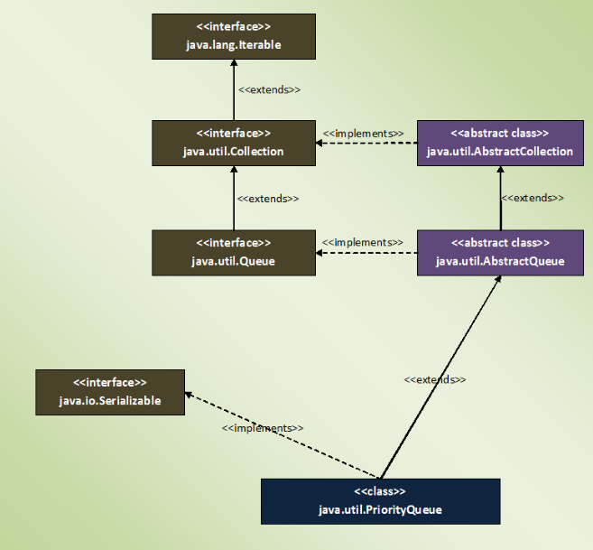

### Priority Queue
- is a special type of queue because it is not a First-In-First-Out (FIFO)
- but, elements are placed according to supplied Comparator.
- priorityQueue does not allow null elements.

```java
public class PriorityQueue<E> extends AbstractQueue<E>
    implements java.io.Serializable
```


- Constructor :
```java 
public PriorityQueue() {
        this(DEFAULT_INITIAL_CAPACITY, null);
}

public PriorityQueue(Comparator<? super E> comparator) {
        this(DEFAULT_INITIAL_CAPACITY, comparator);
}

public PriorityQueue(int initialCapacity,
                         Comparator<? super E> comparator)
```

- internal datastructure - Object[] queue; 

### Properties
- elements in the PriorityQueue are ordered according to supplied Comparator.
- priorityQueue is unbounded. 
    - means the capacity of the PriorityQueue increases automatically if the size exceeds capacity. 
- can have duplicate elements but can not have null elements.
- all elements of the PriorityQueue must be of Comparable type. Otherwise ClassCastException will be thrown at run time.
- the default initial capacity of PriorityQueue is 11.
- the head element of the PriorityQueue is always the least element and tail element is always the largest element according to specified Comparator.
- priorityQueue is not thread safe.
- we can retrieve the Comparator used to order the elements of the PriorityQueue using comparator() method.
- if we don’t supply the Comparator while creating a PriorityQueue, elements will be ordered in natural ascending order


