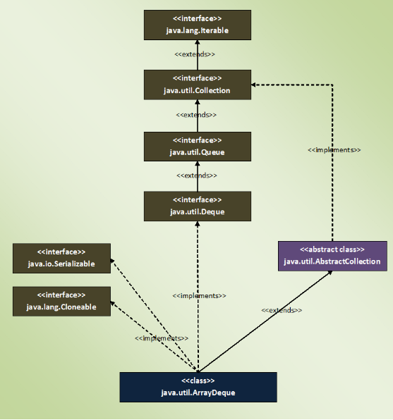

### ArrayDeque

- ArrayDeque is a resizable-array implementation of Deque interface
- ArrayDeque does not have any capacity limit. 
    - It will grow automatically as we add elements.

```java
public class ArrayDeque<E> extends AbstractCollection<E>
                           implements Deque<E>, Cloneable, Serializable
```


- Default initial capacity of ArrayDeque is 16. 
    - It will increase at a power of 2 when size exceeds capacity.
- ArrayDeque can be used as a stack (LIFO) as well as a queue (FIFO).
- Performance of ArrayDeque is sometimes considered as the best among the collection framework. 
    - It gives performance of O(1) for insertion, removal and retrieval operations. 
- ArrayDeque is faster than the Stack class when used as a stack 
- Faster than the LinkedList class when used as a queue.
    - ArrayDeque class is recommended instead of Stack class (when you want stack data structure) 
    - instead of LinkedList class (when you want queue data structure).
- You can’t perform indexed operations on ArrayDeque. ArrayDeque doesn’t have the methods to support those operations.
- ArrayDeque is not a thread safe.

---


