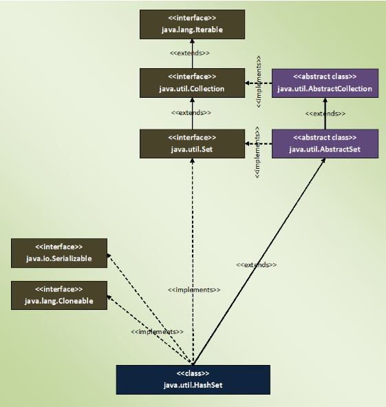

### HashSet 
- collection of unique objects.
- HashSet internally uses HashMap to store the objects.
- elements we insert in HashSet will be stored as:
    - keys of the HashMap object 
    - their values will be constant called PRESENT.
    -  This constant is defined as 
    ```JAVA
    private static final Object PRESENT = new 
    Object()
    ```
    in the source code of HashSet class.
-  HashSet does not allow duplicate elements.   
    - If you try to insert a duplicate element, older element will be overwritten.
- HashSet can have maximum one null element.
- HashSet doesn’t maintain any order. 
    - The order of the elements will be largely unpredictable. 
    - And it also doesn’t guarantee that order will remain constant over time.
- HashSet offers constant time performance for insertion, removal and retrieval operations.
-  If we want our elements to be ordered in some way, you can use LinkedHashSet or TreeSet.
- HashSet class is not synchronized. 
    - If we want synchronized HashSet, use Collections.synchronizedSet() method.
```java
Set<String> syncSet = Collections.synchronizedSet(set);
```

```java
public class HashSet<E>
    extends AbstractSet<E>
    implements Set<E>, Cloneable, java.io.Serializable
```


### How HashSet Works Internally In Java?
- Whenever we create a HashSet object
    - one HashMap object associated with it is also created
- default initial capacity (16) and load factor (0.75).
```java
private transient HashMap<E,Object> map;
//Constructor - 1
public HashSet()
{
        map = new HashMap<>();          //Creating internally backing HashMap object
}
//Constructor - 2 
public HashSet(Collection<? extends E> c)
{
        map = new HashMap<>(Math.max((int) (c.size()/.75f) + 1, 16));     //Creating internally backing HashMap object
        addAll(c);
}
//Constructor - 3
public HashSet(int initialCapacity, float loadFactor)
{
        map = new HashMap<>(initialCapacity, loadFactor);        //Creating internally backing HashMap object
}
```
- every constructor internally creates one new HashMap object.
- all methods of HashSet class process internally backing HashMap object to get the desired result.


