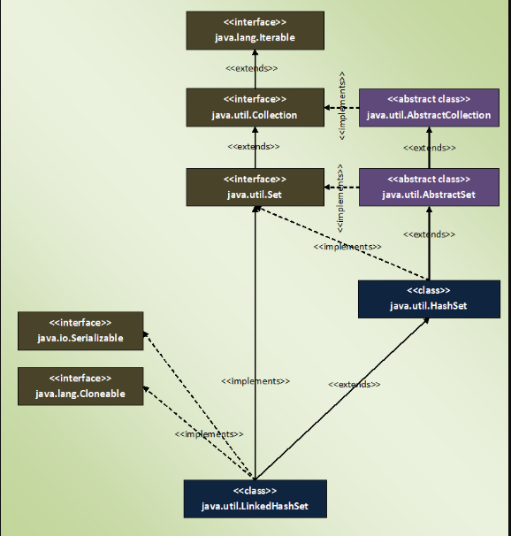

### LinkedHashSet

- it is an ordered(insertion) version of hashset
- doesn't allow duplicate elements and allows only one null element
- internally maintains one doubly linked list
    - responsible for maintaining the order of elements.
- LinkedHashSet is recommended over HashSet if you want a unique collection of objects in an insertion order.



### Properties Of LinkedHashSet
- it internally uses LinkedHashMap to store it's element.
- gives constant time performance for insertion, removal and retrieval operations.
    - performance is slightly less than HashSet because it maintains doubly linked list
- iterator returned by LinkedHashSet is fail-fast
    - if the LinkedHashSet is modified at any time after the iterator is created
    - it throws ConcurrentModificationException
- is not synchronized, to get synchronized LinkedHashSet, use Collections.synchronizedSet() method.

### How LinkedHashSet Works Internally In Java?
- 4 constructors in LinkedHashSet 
- all are calling the super class constructor
```java
//Constructor - 1
public LinkedHashSet(int initialCapacity, float loadFactor)
{
      super(initialCapacity, loadFactor, true);              //Calling super class constructor
}
//Constructor - 2
public LinkedHashSet(int initialCapacity)
{
        super(initialCapacity, .75f, true);             //Calling super class constructor
}
//Constructor - 3
public LinkedHashSet()
{
        super(16, .75f, true);                //Calling super class constructor
}
//Constructor - 4
public LinkedHashSet(Collection<? extends E> c)
{
        super(Math.max(2*c.size(), 11), .75f, true);          //Calling super class constructor
        addAll(c);
}
```
```java
//super constructor
HashSet(int initialCapacity, float loadFactor, boolean dummy)
{
        map = new LinkedHashMap<>(initialCapacity, loadFactor);
}
```
- this super constructor takes initial capacity, load factor and one boolean dummy value as it’s arguments.
- boolean dummy value is used to differentiate this constructor from other constructor
- all methods are inherited from it's super class
- all operations work in the same manner
- in LinkedHashSet, elements you insert are stored as keys of LinkedHashMap object. 
    - values of these keys will be the same constant PRESENT

### How LinkedHashSet Maintains Insertion Order?
- Each [key, value] pair in the LinkedHashMap are instances of it’s static inner class called Entry<K, V>
    - Entry<K, V> class extends HashMap.Entry class. 
-  insertion order of elements into LinkedHashMap are maintained by adding two new fields
    - they are before and after. 
    - These two fields make LinkedHashMap to function as a doubly linked list.
-  the same set of Entry objects (rather references to Entry objects) are arranged in two different manner. 
    - One is the HashMap 
    - another one is Doubly linked list.


