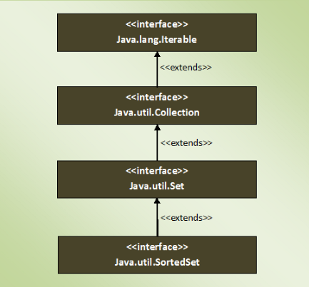

### SortedSet Interface
- it extends Set Interface.
- it is a set in which elements are placed according to supplied comparator.
    - this comparator is supplied while creating a SortedSet
    - if we don't supply elements will be in ascending order
- can't have null elements, it will give NullPointerException at run time.
- duplicate elements are not allowed.
- inserted elements must be of Comparable type and they must be mutually comparable.
- we can't access SortedSet elements Randomly.
- SortedSets returned by headSet(), tailSet() and subSet() methods are just views of the original set.
    - so changes in the returned set will be reflected in the original one and vice versa

### Methods 
- along with the inherited methods from Set interface
- processing of SortedSet elements more easy

| SortedSet Interface Methods | Description |
|---|---|
| Comparator<? super E> comparator() | Returns Comparator used to order the elements. If no comparator is supplied, it returns null. |
| SortedSet<E> subSet(E fromElement, E toElement) | Returns a portion of this set whose elements range from ‘fromElement’ (Inclusive) and ‘toElement’ (Exclusive). |
| SortedSet<E> headSet(E toElement) | Returns a SortedSet whose elements are in the range from first element of the set (Inclusive) to ‘toElement’ (exclusive). |
| SortedSet<E> tailSet(E fromElement) | Returns a SortedSet whose elements are in the range from ‘fromElement’ (Inclusive) to last element of the set (exclusive). |
| E first() | Returns first element of the SortedSet. |
| E last() | Returns last element of the SortedSet. |