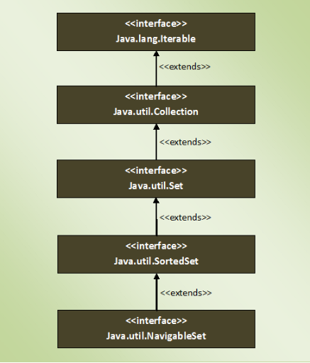

### NavigableSet Interface
- is a SortedSet with navigation facilities.
- provides many methods through them we can easily find closest matches of any given element
- has methods to find out less than, less than or equal to, greater than amd greater than or equal of any element in a SortedSet.
- can't have null elements.
- doesn't support duplicate elements.
- NavigableSet can be traversed and accessed in either ascending or descending order.

### Methods
| NavigableSet Interface Methods | Description |
|---|---|
| E lower(E e) | Returns greatest element in this set which is strictly less than the given element. |
| E floor(E e) | Returns greatest element in this set which is less than or equal to the given element. |
| E ceiling(E e) | Returns the least element in this set which is greater than or equal to the given element. |
| E higher(E e) | Returns the least element in this set which is strictly greater than the given element. |
| E pollFirst() | Retrieves and removes the first element in this set. |
| E pollLast() | Retrieves and removes last element in this set. |
| NavigableSet<E> descendingSet() | Returns reverse order view of this set. |
| Iterator<E> descendingIterator() | Returns an iterator over the elements of this set in descending order. |
| NavigableSet<E> subSet(E fromElement, boolean fromInclusive, E toElement, boolean toInclusive) | Returns a view of this set whose elements are in the range from ‘fromElement’ to ‘toElement’. |
| NavigableSet<E> headSet(E toElement, boolean inclusive) | Returns a view of this set whose elements are in the range from first element of this set to ‘toElement’. |
| NavigableSet<E> tailSet(E fromElement, boolean inclusive) | Returns a view of this element whose elements are in the range from ‘fromElement’ to last element of this set. |