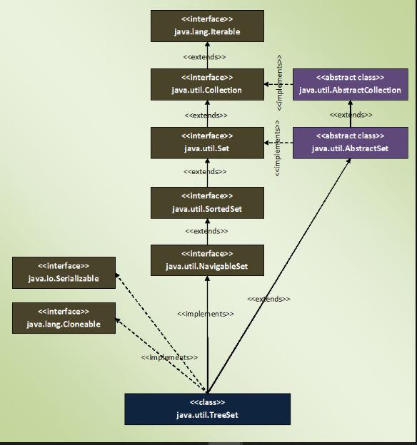

### TreeSet
- TreeSet are sorted according to supplied Comparator.
- if we don't pass any Comparator while creating a TreeSet, elements will be in ascending order.
- Elements inserted in the TreeSet must be of Comparable type and elements must be mutually comparable. 
    - If the elements are not mutually comparable, you will get ClassCastException at run time.
- does not allow even a single null element
- is not synchronized. 
    - To get a synchronized TreeSet, use Collections.synchronizedSortedSet() method.
- TreeSet gives performance of order log(n) for insertion, removal and retrieval operations.
- Iterator returned by TreeSet is of fail-fast nature.
    - means if TreeSet is modified after the creation of Iterator object, you will get ConcurrentModificationException.
- TreeSet internally uses TreeMap to store it’s elements



```java
public class TreeSet<E> extends AbstractSet<E>
    implements NavigableSet<E>, Cloneable, java.io.Serializable
```

### Differences Between HashSet, LinkedHashSet and TreeSet In Java

|  | HashSet | LinkedHashSet | TreeSet |
|---|---|---|---|
| How they work internally? | HashSet uses HashMap internally to store it’s elements. | LinkedHashSet uses  LinkedHashMap internally to store it’s elements. | TreeSet uses TreeMap internally to store it’s elements. |
| Order Of Elements | HashSet doesn’t maintain any order of elements. | LinkedHashSet maintains insertion order of elements. i.e elements are placed as they are inserted. | TreeSet orders the elements according to supplied Comparator. If no comparator is supplied, elements will be placed in their natural ascending order. |
| Performance | HashSet gives better performance than the LinkedHashSet and TreeSet. | The performance of LinkedHashSet is between HashSet and TreeSet. It’s performance is almost similar to HashSet. But slightly in the slower side as it also maintains LinkedList internally to maintain the insertion order of elements. | TreeSet gives less performance than the HashSet and LinkedHashSet as it has to sort the elements after each insertion and removal operations. |
| Insertion, Removal And Retrieval Operations | HashSet gives performance of order O(1) for insertion, removal and retrieval operations. | LinkedHashSet also gives performance of order O(1) for insertion, removal and retrieval operations. | TreeSet gives performance of order O(log(n)) for insertion, removal and retrieval operations. |
| How they compare the elements? | HashSet uses equals() and hashCode() methods to compare the elements and thus removing the possible duplicate elements. | LinkedHashSet also uses equals() and hashCode() methods to compare the elements. | TreeSet uses compare() or compareTo() methods to compare the elements and thus removing the possible duplicate elements. It doesn’t use equals() and hashCode() methods for comparision of elements. |
| Null elements | HashSet allows maximum one null element. | LinkedHashSet also allows maximum one null element. | TreeSet doesn’t allow even a single null element. If you try to insert null element into TreeSet, it throws NullPointerException. |
| Memory Occupation | HashSet requires less memory than LinkedHashSet and TreeSet as it uses only HashMap internally to store its elements. | LinkedHashSet requires more memory than HashSet as it also maintains LinkedList along with HashMap to store its elements. | TreeSet also requires more memory than HashSet as it also maintains Comparator to sort the elements along with the TreeMap. |
| When To Use? | Use HashSet if you don’t want to maintain any order of elements. | Use LinkedHashSet if you want to maintain insertion order of elements. | Use TreeSet if you want to sort the elements according to some Comparator. |


### Similarities Between HashSet, LinkedHashSet and TreeSet In Java :
---
- All three doesn’t allow duplicate elements.
- All three are not synchronized.
- All three are Cloneable and Serializable.
- Iterator returned by all three is fail-fast in nature. i.e You will get ConcurrentModificationException if they are modified after the creation of Iterator object.