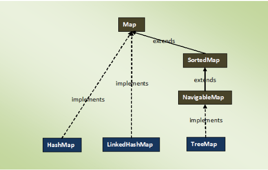

### Map Interface
- map is an object of key-value pairs
    - where each key is associated with a value
- this interface is the replacement for ‘Dictionary‘ class which is an abstract class introduced in JDK 1.0.
- Map interface is a part of Java Collection Framework, but it doesn’t inherit Collection Interface.
- a map can not have duplicate keys but can have duplicate values.
    - each key at most must be associated with one value.
- each key-value pairs of the map are stored as Map.Entry objects.  
    - Map.Entry is an inner interface of Map interface.
- Order of elements in map is implementation dependent.
    - HashMap doesn’t maintain any order of elements. 
    - LinkedHashMap maintains insertion order of elements.
    - TreeMap places the elements according to supplied Comparator.
- Map interface provides three methods, which allows map’s contents to be viewed as a:
    - set of keys (keySet() method)
    - collection of values (values() method)
    - or set of key-value mappings (entrySet() method).

### Methods Of Map Interface In Java :

| Methods | Descriptions |
|---|---|
| int size() | Returns number of key-value pairs in this map. |
| boolean isEmpty() | Checks whether this map is empty or not. |
| boolean containsKey(Object key) | Returns true if this map contains a mapping for the specified key. |
| boolean containsValue(Object value) | Returns true if this map contains one or more keys associated with the specified value. |
| V get(Object key) | Returns value associated with the specified key. |
| V put(K key, V value) | Adds the specified key-value pair to this map. If the specified key already exist in the map, old value will be replaced by the specified value. |
| V remove(Object key) | Removes the specified key along with it’s value from this map. |
| void putAll(Map<? extends K, ? extends V> m) | Copies all key-value pairs from the specified map to this map. |
| void clear() | Removes all mappings from this map. |
| Set<K> keySet() | Returns a set containing all keys of this map. The returned set is backed by actual map. So, changes made to the map are reflected in the set and vice-versa. |
| Collection<V> values() | Returns a collection of values of this map. The returned collection is backed by actual map. So, any changes made to the map is reflected in collection and vice-versa. |
| Set<Map.Entry<K, V>> entrySet() | Returns set view of the mappings contained in this map. |
| boolean equals(Object o) | Compares the specified object with this map. |
| int hashCode() | Returns hashcode value of this map. |
