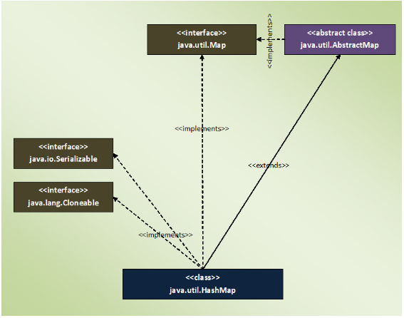
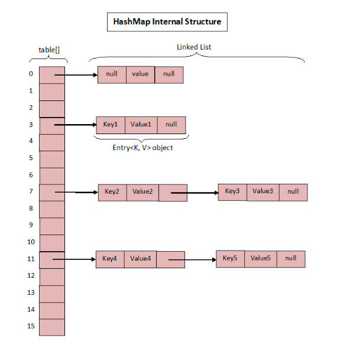

### HashMap
- holds the data in the form of key-value pairs where each key is associated with one value.
- HashMap maintains no order.
- HashMap gives constant time performance for the operations like get() and put() methods.
- HashMap doesn’t allow duplicate keys. But it can have duplicate values.
- HashMap can have multiple null values and only one null key.
- HashMap is not synchronized.
    - To get the synchronized HashMap, use Collections.synchronizedMap() method.
- Default initial capacity of HashMap is 16.
- give O(1) performance for put and get operations.

```java
public class HashMap<K,V> extends AbstractMap<K,V>
    implements Map<K,V>, Cloneable, Serializable 
```


### Methods Of HashMap In Java :

| Method | Description|
|---|---|
| public V put(K key, V value) | <li>This method inserts specified key-value mapping in the map.</li><li> If map already has a mapping for the specified key, then it rewrites that value with new value.</li>|
| public void putAll(Map<? extends K, ? extends V> m) | This method copies all of the mappings of the map m to this map. |
| public V get(Object key) | This method returns the value associated with a specified key. |
| public int size() | This method returns the number of key-value pairs in this map. |
| public boolean isEmpty() | This method checks whether this map is empty or not. |
| public boolean containsKey(Object key) | This method checks whether this map contains the mapping for the specified key. |
| public boolean containsValue(Object value) | This method checks whether this map has one or more keys mapping to the specified value. |
| public V remove(Object key) | This method removes the mapping for the specified key. |
| public void clear() | This method removes all the mappings from this map.|
| public Set<K> keySet() | This method returns the Set view of the keys in the map.|
| public Collection<V> values() | This method returns Collection view of the values in the map.|
| public Set<Map.Entry<K, V>> entrySet() | This method returns the Set view of all the mappings in this map. |
| public V putIfAbsent(K key, V value) | This method maps the given value with specified key if this key is currently not associated with a value or mapped to a null.|
| public boolean remove(Object key, Object value) | This method removes the entry for the specified key if this key is currently mapped to a specified value.|
| public boolean replace(K key, V oldValue, V newValue) | This method replaces the oldValue of the specified key with newValue if the key is currently mapped to oldValue. |
| public V replace(K key, V value) | This method replaces the current value of the specified key with new value. |

### How it works internally:
- Each key-value pair is stored in an object of Entry<K, V> class. 
- Entry<K, V> class is the static inner class of HashMap which is defined like below:
```java
static class Entry<K,V> implements Map.Entry<K,V> 
{
        final K key;
        V value;
        Entry<K,V> next;    // pointer to next key-value pairThis makes the key-value pairs stored as a linked list. 
        int hash;   // It holds the hashcode of the key.
 
        //Some methods are defined here
}
```
- All these Entry<K, V> objects are stored in an array called table[]. 
>  transient Entry<K,V>[] table;



- It doesn’t inserts the objects as you put them into HashMap
    - i.e first element at index 0, second element at index 1 and so on.
- Instead it uses the hashcode of the key to decide the index for a particular key-value pair.
    - It is called Hashing.

### What Is Hashing?
-  Hashing is nothing but the function or algorithm or method which when applied on any object/variable returns an unique integer value representing that object/variable. 
- This unique integer value is called hash code. 
- Hash function or simply hash said to be the best if it returns the same hash code each time it is called on the same object.
    - Two objects can have same hash code.
- Whenever we insert new key-value pair using put() method, HashMap blindly doesn’t allocate slot in the table[] array.
    - Instead it calls hash function on the key.
- HashMap has its own hash function to calculate the hash code of the key.
    - This function is implemented so that it overcomes poorly implemented hashCode() methods.

- After calculating the hash code of the key, it calls indexFor() method by passing the hash code of the key and length of the table[] array.
    - This method returns the index in the table[] array for that particular key-value pair.

[Internal Implementaion of put() and get()](https://javaconceptoftheday.com/how-hashmap-works-internally-in-java/)

### Initial Capacity And Load Factor Of HashMap In Java
- There are two factors which affect the performance of HashMap.
    - one is the load factor
    - one is initial capacity.

**Initial Capacity Of HashMap :**
- The capacity of an HashMap is the number of buckets in the hash table. 
- The initial capacity is the capacity of an HashMap at the time of its creation. 
- The default initial capacity of the HashMap is 2<sup>4</sup> i.e 16. 
- The capacity of the HashMap is doubled each time it reaches the threshold.
    - i.e the capacity is increased to 2<sup>5</sup>=32, 2<sup>6</sup>=64, 2<sup>7</sup>=128….. when the threshold is reached.

**Load Factor Of HashMap :**
- Load factor is the measure which decides when to increase the capacity of the HashMap. 
- The default load factor is 0.75f.

**How The Threshold Is Calculated?**

- The threshold of an HashMap is the product of current capacity and load factor.

> Threshold = (Current Capacity) * (Load Factor)

- For Example, if the HashMap is created with initial capacity of 16 and load factor of 0.75f, then threshold will be,

> Threshold = 16 * 0.75 = 12

- That means, the capacity of the HashMap is increased from 16 to 32 after the 12th element (key-value pair) is added into the HashMap.

### Rehashing
- Whenever HashMap reaches its threshold, rehashing takes place. 
- Rehashing is a process where new HashMap object with new capacity is created and all old elements (key-value pairs) are placed into new object after recalculating their hashcode. 
- This process of rehashing is both space and time consuming. 
- Choose the initial capacity and load factor such that they minimize the number of rehashing operations.

[Read more..](https://javaconceptoftheday.com/initial-capacity-and-load-factor-of-hashmap-in-java/)

---
### HashMap vs HashSet In Java :

| HashSet | HashMap |
|---|---|
| HashSet implements Set interface. | HashMap implements Map interface. |
| HashSet stores the data as objects. | HashMap stores the data as key-value pairs. |
| HashSet internally uses HashMap. | HashMap internally uses an array of Entry<K, V> objects. |
| HashSet doesn’t allow duplicate elements. | HashMap doesn’t allow duplicate keys, but allows duplicate values. |
| HashSet allows only one null element. | HashMap allows one null key and multiple null values. |
| Insertion operation requires only one object. | Insertion operation requires two objects, key and value. |
| HashSet is slightly slower than HashMap. | HashMap is slightly faster than HashSet. |

### Similarities Between HashMap And HashSet In Java :
- Both data structures don’t maintain any order for the elements.
- Both use hashCode() and equals() method to maintain the uniqueness of the data.
- The iterators returned by both are fail-fast in nature.
- Both give constant time performance for insertion and removal operations.
- Both are not synchronized.

### Differences Between HashMap And HashTable In Java
| HashMap | HashTable |
|---|---|
| HashMap is not synchronized and therefore it is not thread safe. | HashTable is internally synchronized and therefore it is thread safe. |
| HashMap allows maximum one null key and any number of null values. | HashTable doesn’t allow null keys and null values. |
| Iterators returned by the HashMap are fail-fast in nature. | Enumeration returned by the HashTable are fail-safe in nature. |
| HashMap extends AbstractMap class. | HashTable extends Dictionary class. |
| HashMap returns only iterators to traverse. | HashTable returns both Iterator as well as Enumeration for traversal. |
| HashMap is fast. | HashTable is slow. |
| HashMap is not a legacy class. | HashTable is a legacy class. |
| HashMap is preferred in single threaded applications. If you want to use HashMap in multi threaded application, wrap it using Collections.synchronizedMap() method. | Although HashTable is there to use in multi threaded applications, now a days it is not at all preferred. Because, ConcurrentHashMap is better option than HashTable. |

### Convert HashMap To ArrayList In Java 
- Conversion Of HashMap Keys Into ArrayList :
```java
HashMap<String, String> map = new HashMap<String, String>(); 
         
//Getting Set of keys from HashMap 
         
Set<String> keySet = map.keySet(); 
         
//Creating an ArrayList of keys by passing the keySet 
         
ArrayList<String> listOfKeys = new ArrayList<String>(keySet);
```
- Conversion Of HashMap Values Into ArrayList :
```java 
//Creating a HashMap object 
         
HashMap<String, String> map = new HashMap<String, String>(); 
         
//Getting Collection of values from HashMap 
         
Collection<String> values = map.values(); 
         
//Creating an ArrayList of values 
         
ArrayList<String> listOfValues = new ArrayList<String>(values);
```
- Conversion Of HashMap’s Key-Value Pairs Into ArrayList :
```java
//Creating a HashMap object 
         
HashMap<String, String> map = new HashMap<String, String>(); 
                  
//Getting Set of entries from HashMap 
                  
Set<Entry<String, String>> entrySet = map.entrySet(); 
                  
//Creating an ArrayList of Entry objects 
                  
ArrayList<Entry<String, String>> listOfEntry = new ArrayList<Entry<String, String>>(entrySet);

```
---

### Java 8 – Convert Map To List
- Java 8 – Convert Map Keys To List
```java
//Creating a Map object
         
Map<String, Integer> map = new HashMap<String, Integer>();
         
//Java 8 code to convert map keys to list
         
List<String> listOfKeys = map.keySet().stream().collect(Collectors.toList());
         
//Java 8 code to print List elements
         
listOfKeys.forEach(System.out::println);
```
- Java 8 – Convert Map Values To List
```java
//Creating a Map object
         
Map<String, Integer> map = new HashMap<String, Integer>();
         
//Java 8 code to convert map values to list
         
List<Integer> listOfValues = map.values().stream().collect(Collectors.toList());
         
//Java 8 code to print List elements
         
listOfValues.forEach(System.out::println);
```
- Java 8 – Sort And Convert Map Keys To List
```java
//Creating a Map object
         
Map<String, Integer> map = new HashMap<String, Integer>();
             
//Java 8 code to sort and convert map keys to list
                 
List<String> listOfKeys = map.keySet().stream().sorted().collect(Collectors.toList());
                 
//Java 8 code to print List elements
                 
listOfKeys.forEach(System.out::println);
```
- Java 8 – Sort And Convert Map Values To List

```java
//Creating a Map object
         
Map<String, Integer> map = new HashMap<String, Integer>();
             
//Java 8 code to sort and convert map values to list
                 
List<Integer> listOfValues = map.values().stream().sorted().collect(Collectors.toList());
                 
//Java 8 code to print List elements
                 
listOfValues.forEach(System.out::println);
```

